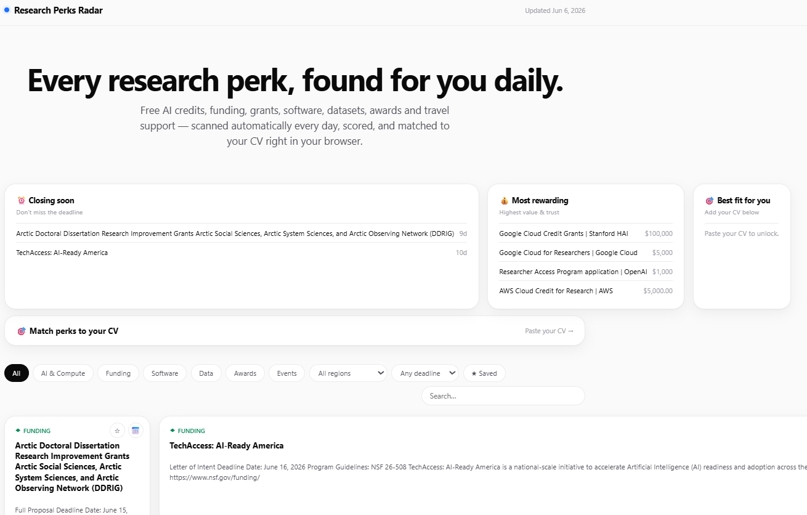

# research-perks-radar 🛰️

> An open, auto-updating radar for research perks — free AI/compute credits, funding & grants, academic software discounts, datasets, awards, and travel support. Scanned daily, scored automatically, and matched to *your* CV right in your browser.

[](https://github.com/Jiaye1998/research-perks-radar/actions/workflows/daily.yml)
[](https://github.com/Jiaye1998/research-perks-radar/actions/workflows/ci.yml)
[](https://jiaye1998.github.io/research-perks-radar/)
[](LICENSE)

**Live site:** **https://jiaye1998.github.io/research-perks-radar/**

<!--STATS-->
**111 live perks** · ai_compute: 24 · funding: 25 · software: 4 · data: 20 · awards: 14 · events: 24 · updated 2026-07-23
<!--/STATS-->

[](https://jiaye1998.github.io/research-perks-radar/)

## Use with Codex

This repository includes a Codex Skill for working with Research Perks Radar.

In Codex, ask:

```text
Install the Codex Skill from https://github.com/Jiaye1998/research-perks-radar/tree/main/skills/research-perks-radar
```

Then restart Codex or open a new thread so the Skill is picked up.

After installation, you can ask Codex things like:

```text
Use the Research Perks Radar Skill to refresh the data and run the checks.
```

```text
Use the Research Perks Radar Skill to update the web output after a data refresh.
```

---

## What it does

Every day, a GitHub Action runs a **zero-LLM** Python pipeline that:

1. **Fetches** candidate perks from four kinds of sources — curated sites, free search APIs (Tavily + Brave), RSS feeds, and Reddit.
2. **Processes** them with a pure rule engine — dedup, classify into 6 categories, extract amount/deadline/region, filter noise, score, and flag deadlines.
3. **Publishes** `data/perks.json` and rebuilds a clean, Apple-style Next.js site deployed to GitHub Pages.

**CV matching happens entirely in your browser.** You paste your CV and your own LLM API key (Anthropic / OpenAI / Google); the page calls the model directly and re-ranks perks by fit. Your CV and key never leave the page and never touch our servers — there are no servers.

## The six categories

| Category | What's in it |
|---|---|
| `ai_compute` | Free AI tool credits, API quotas, HPC/cloud compute for researchers |
| `funding` | Grants, fellowships, seed funding, travel awards |
| `software` | Academic licenses & discounts (GitHub, JetBrains, Overleaf, …) |
| `data` | Dataset access, infrastructure programs |
| `awards` | Scholarships, prizes, postdoc fellowships |
| `events` | Conference fee waivers, travel grants, summer schools |

## Repo layout

```
.github/workflows/daily.yml   # cron + build + deploy
pipeline/                     # Python backend (no LLM)
  main.py                     # orchestrator
  sources.yaml                # data sources — PRs welcome!
  fetchers/                   # curated / search / rss / reddit
  rules/                      # classify · extract · filter · score · urgency
  dedup.py
data/perks.json               # main feed the site reads
data/history/                 # daily snapshots
web/                          # Next.js static site
```

## Run the pipeline locally

```bash
cd pipeline
pip install -r ../requirements.txt
# optional free keys for richer results:
export TAVILY_API_KEY=...      # tavily.com  (1000/mo free)
export BRAVE_API_KEY=...       # brave.com/search/api (2000/mo free)
python main.py                 # writes ../data/perks.json
```

No keys? It still runs — curated sources, RSS, and Reddit need none.

## Run the site locally

```bash
cd web
npm install
npm run dev      # http://localhost:3000
```

## Contributing sources

Add an entry to `pipeline/sources.yaml` and open a PR. See the comments in that file for the schema.

## License

MIT
